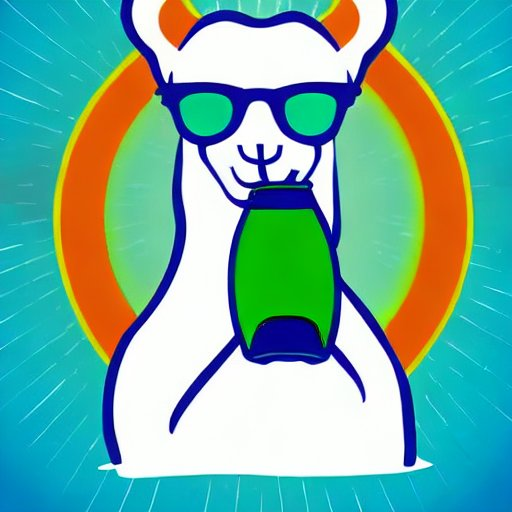

# DistillLama

Distill knowledge with local LLMs





Distilllama let you distill your knowledge intro your locally running LLM, using the same model for embeddings. 

Based on LangChain and LLama.cpp This work is heavily in progress.


Install the requirements:
```shell
pip install -r requirements.txt
```

Copy the sample.env to .env file:
```shell
cp sample.env .env
```

Edit the .env file setting the variables according to your path.

Run it:
```shell
python3 distilllama.py
```
